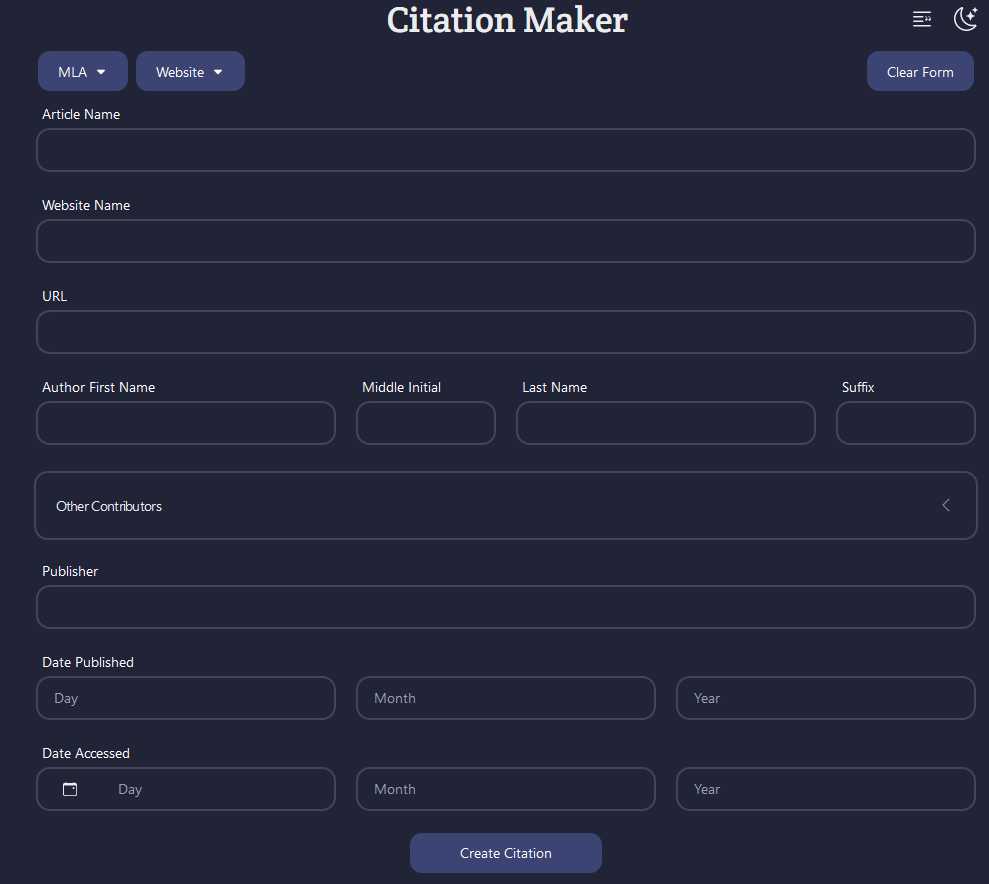

   

## About

Citation Maker is a website that will generate MLA citations for websites, books, and journals. [Click here to start making citations!](https://citation-maker.netlify.app/)

### Built With

- NextJs
- NextUI 1.0
- NextThemes
- Cypress
- Typescript
- Netlify

## Usage

1. Visit Citation Maker by visiting the Netlify page [here](https://citation-maker.netlify.app/).
2. By default, light mode is enabled. Click the sun/moon icon in the top right to toggle between the themes.
3. Select a citation style. At the moment, only MLA is available.
4. Select the type of source you are citing. If your source is neither a website, book, nor journal, use miscellaneous.
5. Input all available information from your source into the text input fields.
6. Click the `Create Citation` button and you will be redirected to the citation page.
7. On the citation page, you will be able to copy, edit, or delete entries using the buttons on the right side of the citation card.

## Features

- Light and dark themes
- Create MLA citations for websites, books, and journals
- Local storage for citations and theme preferences
- Edit and delete citations

### Planned Features

- Copy all citations
- Other contributor roles
- APA style (Ko-fi goal)

## Contribute

Feel free to submit a GitHub issue for any bugs found in Citation Maker; suggestions for new features are also welcome. Use the issue template pinned in the Issues tab to make documenting bugs easier!

## Contact

Alexis Woelffer
 

(<a href="#readme-top">back to top</a>)

